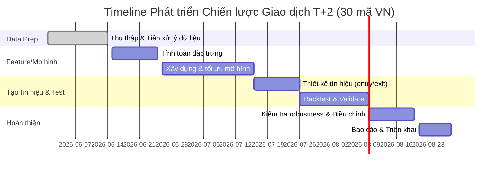

# Tóm tắt điều hành  
Nghiên cứu đề xuất xây dựng chiến lược giao dịch T+2 (giữ lệnh tối đa 2 ngày) cho 30 mã VN, tập trung vào tỷ lệ thắng cao. Quy trình bao gồm: thu thập và xử lý dữ liệu giá – khối lượng (điều chỉnh chia tách, cổ tức, đồng bộ khung thời gian); tạo đặc trưng kỹ thuật (giá, biến động, các chỉ báo ATR, RSI, MACD, Bollinger, VWAP, OBV, ADX, các đường MA, v.v.); xây dựng nhiều mô hình dự báo (từ quy tắc đơn giản đến ML như hồi quy logistic, RF, XGBoost, LightGBM, SVM, MLP, LSTM) và tổ hợp (ensemble); xác định quy tắc phát tín hiệu (vào/ra lệnh, dừng lỗ, chốt lời, gia tăng/giảm tỷ lệ, quy tắc khối lượng), giới hạn rủi ro (rủi ro/trade, hạn chế danh mục). Thiết kế backtest sử dụng phương pháp *walk-forward* hoặc cross-validation thời gian, tính toán chi phí giao dịch, trượt giá, ảnh hưởng thị trường và thời điểm thực thi T+2; đánh giá chiến lược bằng các chỉ số như tỷ lệ thắng (Win Rate), độ chính xác (precision), độ gọi (recall), Sharpe, Sortino, drawdown tối đa, lợi nhuận kỳ vọng (expectancy), hệ số lợi nhuận (profit factor); kiểm tra tính chắc chắn (độ nhạy tham số, dữ liệu ngoài mẫu, mô phỏng Monte Carlo, kịch bản bi quan). Trong triển khai cần lưu ý độ trễ hệ thống, đường ống dữ liệu (data pipeline), giám sát hiệu suất và lịch tái huấn luyện. Giả định: phí hoa hồng ~0.15–0.3%/giao dịch【24†L172-L179】, thuế bán 0.1%【24†L223-L229】, vốn ban đầu tùy chọn (ví dụ 1 tỷ VNĐ), sử dụng đòn bẩy tối đa 1:1 (cash). Kế hoạch triển khai tuần tự, ưu tiên cao cho thu thập/chuẩn bị dữ liệu và thiết kế backtest.  

## Tiền xử lý dữ liệu  
- **Nguồn dữ liệu:** Sử dụng VNStock API để tải dữ liệu lịch sử giá và khối lượng của 30 mã (VN30 hoặc nhóm chọn). Đảm bảo dữ liệu đầy đủ từ ngày A đến ngày B, gồm Open/High/Low/Close/Volume (có thể sử dụng giá “Adj Close” nếu có chỉnh sửa cổ tức và chia tách)【43†L124-L132】.  
- **Điều chỉnh Corporate Actions:** Dữ liệu phải điều chỉnh sự kiện cổ tức, chia tách (splits). Giá đóng cửa điều chỉnh (“Adj Close”) đã bao gồm cổ tức và chia tách để đảm bảo tính liên tục của chuỗi giá【43†L124-L132】. Nếu nguồn không có cột “Adj Close”, tự tính hệ số điều chỉnh dựa trên lịch chia tách và cổ tức của công ty.  
- **Thời gian & Giờ giao dịch:** Đồng bộ múi giờ (VN). Nếu dùng dữ liệu intraday, quy chuẩn về khung thời gian (ví dụ theo phút) và lấp các khoảng trống. Đối với dữ liệu vài giây, cần gom (resample) về khung thời gian (ví dụ 1 phút). Đảm bảo định dạng ngày-tháng phù hợp.  
- **Xử lý thiếu hụt và nhiễu:** Kiểm tra giá trị thiếu, giá trị ngoại lai (outliers). Theo kinh nghiệm, dữ liệu chứng khoán VN có thể thiếu bản ghi ngày lễ Tết, v.v. Loại bỏ hoặc nội suy hợp lý các giá trị trống【41†L619-L627】【41†L628-L639】. Dùng phương pháp IQR hoặc Z-score để phát hiện outliers và quyết định loại bỏ hoặc cố định. Chuẩn hóa hoặc scale khi cần thiết (ví dụ Min-Max hoặc Standardization)【41†L652-L661】.  
- **Resampling (nếu cần):** Nếu dữ liệu tick/minute, có thể gom về biểu đồ 5 hoặc 15 phút để giảm nhiễu.  
- **Chuẩn bị tập huấn luyện:** Chia tập dữ liệu thành in-sample (huấn luyện) và out-of-sample (kiểm tra). Sử dụng kỹ thuật *walk-forward*: chia dữ liệu thành nhiều cửa sổ trượt liên tiếp, mỗi cửa sổ dùng để tối ưu tham số và kiểm tra trên dữ liệu sau đó【31†L119-L127】【31†L163-L172】.  

【41†L619-L627】 dữ liệu chứng khoán thường có sai lệch hoặc khuyết, cần kiểm tra thiếu hụt và giá trị ngoại lai bằng các phương pháp thống kê. 【43†L124-L132】 lưu ý sử dụng giá điều chỉnh (adjusted close) đã bao gồm cổ tức và chia tách.  

## Đặc trưng kỹ thuật (Feature Engineering)  
Xây dựng bộ đặc trưng phong phú từ dữ liệu giá và khối lượng:  
- **Giá và lợi nhuận:** Giá đóng/mở/cao/thấp (OHLC) hàng ngày hoặc intraday, lời/lỗ theo phiên và log-return (e.g. ln(P_t/P_{t-1})).  
- **Khối lượng:** Sử dụng khối lượng giao dịch; có thể thêm biến như khối lượng trung bình động.  
- **VWAP:** Giá trung bình có trọng số theo khối lượng trong ngày giúp xác định giá “hợp lý” intraday【48†L286-L294】. Chiến lược thường mua khi giá đang thấp hơn VWAP và bán khi giá vượt VWAP【48†L365-L368】.  
- **Độ biến động:** ATR (Average True Range) đo độ biến động giá trung bình【26†L66-L74】. Lấy ATR n ngày để ước lượng “tâm lý” thị trường.  
- **Động lượng (Momentum):** Có thể tính RSI (14) đo động lượng quá mua/quá bán, MACD (EMA12–EMA26, với đường signal) để xác định xu hướng. RSI giúp nhận biết vượt mua (>70) hoặc vượt bán (<30). MACD cắt đường Signal là tín hiệu xu hướng.  
- **ADX:** Đo sức mạnh xu hướng, có thể dùng chỉ báo ADX (theo Wilder) để lọc các phiên xu hướng mạnh.  
- **Các đường MA:** SMA và EMA các kỳ (ví dụ 5, 20, 50 ngày) để xác định xu hướng. Các điểm giao cắt (crossover) cũng là tín hiệu.  
- **Bollinger Bands:** Dải biến động quanh MA (thường 20, ±2σ) cho biết biên độ đi ngang hoặc đột phá.  
- **OBV/AD (Accumulation/Distribution):** Theo dõi khối lượng tích lũy khi giá lên/xuống (OBV) hoặc tích lũy/phân phối【50†L41-L47】. Kết hợp tín hiệu về dòng vốn.  
- **Đặc trưng đuôi (Lag features):** Sử dụng giá và indicator của vài phiên trước (lag1, lag2…) để hỗ trợ dự báo.  
- **Tính năng chuỗi thời gian bổ sung:** Rolling mean, độ lệch chuẩn động của giá/khối lượng để biểu diễn xu hướng & dao động ngắn hạn【41†L652-L661】. Nếu có dữ liệu order-book, có thể lập chỉ báo proxy về chênh lệch cung-cầu nhưng thường không sẵn có ở thị trường VN.  

【50†L41-L47】 lưu ý: kết hợp nhiều chỉ báo (Đường trung bình, RSI, các chỉ báo giá-khối lượng OBV/ADL…) có thể cải thiện độ chính xác dự đoán. Các đặc trưng trên cần chuẩn hóa nếu đưa vào một số mô hình, và nên kiểm tra tương quan để tránh dư thừa.  

## Các mô hình dự báo ứng viên  
Cân nhắc từ đơn giản đến phức tạp:  
- **Hệ quy & thống kê:** Hồi quy logistic (LR) để phân loại xu hướng tăng/giảm. Mô hình ARIMA/GARCH không phổ biến cho tín hiệu bảy đỏ, thường dùng cho ước lượng biến động.  
- **Mạng nơ-ron cơ bản:** MLP (đa lớp) với 1–2 lớp ẩn là baseline cho ML.  
- **Cây quyết định & ensemble:** Random Forest (RF) dùng nhiều cây ghép (bagging), thường ổn định với dữ liệu tài chính nhiều biến. Boosting (XGBoost, LightGBM) thường cho hiệu quả cao: XGBoost/LGBM điều chỉnh được tham số, dễ tối ưu, đã được sử dụng rộng rãi cho dữ liệu chuỗi thời gian tài chính.  
- **SVM:** Máy vector hỗ trợ phân lớp biên quyết, phù hợp với dữ liệu nhỏ/trung bình, nhưng nhạy với dữ liệu nhiễu.  
- **Mạng nơ-ron chuyên sâu:** LSTM/GRU để khai thác mối quan hệ dài hạn trong chuỗi giá. Nghiên cứu trên thị trường VN cho thấy LSTM đạt độ chính xác cao (>93% dự báo) cho nhiều cổ phiếu【8†L565-L574】. Ví dụ, LSTM 4 lớp với 60 phiên đầu vào đạt ~97% độ chính xác dự báo trên một số cổ phiếu VN30【8†L565-L574】【9†L79-L83】. Hạn chế của LSTM là cần nhiều dữ liệu và tính toán.  
- **Ensemble:** Kết hợp nhiều mô hình (ví dụ stacking hoặc vote) để giảm sai số riêng lẻ. Các framework ML thường hỗ trợ *bagging*, *boosting* và *stacking*. Ensembles có xu hướng cải thiện hiệu suất và giảm overfitting.  

Các nghiên cứu gần đây cho thấy, LSTM và các mô hình ML hiện đại có thể đạt Sharpe ratio cao hơn các mô hình truyền thống【50†L49-L57】. Ví dụ, chiến lược LSTM kết hợp chỉ báo kỹ thuật đạt Sharpe ~1.45【50†L49-L57】, vượt SVM và RF. Tuy vậy, mô hình ML phức tạp dễ overfit, cần kiểm tra chặt ngoài mẫu. Các mô hình như LR, SVM đơn giản có ưu điểm minh bạch và dễ giải thích.  


## Tạo tín hiệu giao dịch  
- **Tín hiệu vào lệnh (Entry):** Có thể dựa trên mẫu giá/chỉ báo (ví dụ breakout khỏi mô hình giá, giao cắt MA, RSI thoát vùng quá mua/quá bán, giá cắt dưới/đến VWAP…) hoặc xác suất xu hướng từ mô hình ML. Ví dụ, mở lệnh mua nếu giá vượt SMA50 và RSI dưới 50 cho thấy xu hướng tăng trở lại, hoặc mô hình RF dự đoán xác suất tăng >60%. (Chiến lược dựa trên *momentum* đã có hiệu quả tương đối ở VN【11†L89-L91】.)  
- **Tín hiệu thoát lệnh (Exit):** Đóng lệnh khi đạt mục tiêu lợi nhuận hoặc giới hạn lỗ, hoặc đến ngày T+2 (cuối ngày giao dịch thứ hai sau ngày vào lệnh). Ví dụ, đặt stop-loss ở -1R (−ATR, hoặc mức giá hỗ trợ gần nhất) và take-profit ở +2R (2×stop-loss)【56†】; hoặc trailing stop khi giá đảo chiều. Nên ràng buộc rằng mọi lệnh phải đóng trước thời điểm thanh toán T+2.  
- **Dừng lỗ/Chốt lời:** Sử dụng tỷ lệ R – ví dụ, đặt chốt lời = 2–3 lần mức rủi ro (2R–3R) để đảm bảo lợi nhuận/rủi ro tối thiểu【55†L138-L146】. Ví dụ, nếu risk per trade = 1% vốn, target TP=2–3%, SL=1%. Nghiên cứu khuyên sử dụng TP ≥ 2R để có tỷ lệ lợi nhuận/rủi ro hấp dẫn.  
- **Gia tăng/thu hẹp khối lượng (Scaling):** Khi tín hiệu rất mạnh (ví dụ giá phá kháng cự quan trọng kèm volume lớn), có thể chia lệnh: mua phần nhỏ ban đầu, bổ sung thêm nếu xu hướng tiếp diễn. Đảo lại nếu tín hiệu yếu dần.  
- **Quy tắc kích thước vị thế:** Tính số lượng cổ phiếu dựa vào mức rủi ro cho phép. Ví dụ, rủi ro tối đa 1–2% vốn cho mỗi lệnh【55†L168-L177】. Đầu tiên xác định stop-loss (mức lỗ tối đa chấp nhận), sau đó chia “rủi ro vốn” cho mức rủi ro/CP để ra số CP mua【55†L168-L177】. Quy tắc chung: không dùng đòn bẩy cao, tập trung giao dịch các mã thanh khoản cao.  
- **Hạn chế danh mục (Portfolio Constraints):** Giới hạn tỷ trọng mỗi mã (ví dụ mỗi mã ≤5% vốn), ngành (mỗi ngành ≤20%), tổng hạng mục (tổng vị thế mở ≤50% vốn). Ngoài ra, tránh quá tập trung vào một hướng (long-only hoặc short-only). Nghiên cứu cho thấy chiến lược long-only ổn định hơn so với long-short ở VN【11†L89-L91】.  

Tóm lại, quy tắc vào/thoát cần rõ ràng (chẳng hạn >2 chỉ báo đồng thuận). Ví dụ: “Mua khi giá đóng cửa vượt MA20, RSI vượt lên 50, VWAP hướng lên, dừng lỗ = -1ATR, chốt lời = +2ATR”【50†L41-L47】【55†L168-L177】. Công thức risk/reward chuẩn và sizing như trên áp dụng cho từng lệnh【55†L168-L177】. Các giá trị dự kiến win-rate tùy phương pháp (ví dụ momentum có win-rate trung bình ~50–60% [Chưa kiểm chứng], ML có thể ~60–70% [Chưa kiểm chứng]) cần được đánh giá qua backtest (ghi chú: đây là ước lượng [Chưa kiểm chứng] vì phụ thuộc dữ liệu cụ thể).  

## Thiết kế backtest  
- **Thời gian và dữ liệu:** Dùng dữ liệu lịch sử đủ dài (ít nhất 3–5 năm) để bao gồm nhiều chu kỳ thị trường. Chia thành in-sample (ví dụ 70–80%) và out-of-sample. Sử dụng *walk-forward* hoặc *expanding window* để chọn tham số và đánh giá xuyên thời gian【31†L119-L127】【31†L163-L172】.  
- **Chi phí giao dịch:** Mô phỏng phí môi giới ~0.15–0.3% giá trị mỗi lệnh【24†L172-L179】, thuế bán 0.1%【24†L223-L229】. Khấu trừ ngay khi tính lợi nhuận.  
- **Slippage (trượt giá):** Xác định mức trượt giá thực tế (ví dụ 0.01%–0.05% giá/CP do chênh lệch giá khớp). Có thể giả định một giá trượt bình quân cố định hoặc phụ thuộc biến động【26†L66-L74】.  
- **Market Impact:** Với khối lượng giao dịch nhỏ trên từng lệnh (ví dụ <5% thanh khoản ngắn hạn của mã), phí tác động thị trường thấp. Nếu backtest cho thấy khối lượng lớn, cần chia lệnh (IFO) để giảm thị trường bị tác động【26†L85-L94】. Tóm lại, mô hình giả định “thị trường đủ thanh khoản” nếu giao dịch ít.  
- **Loại lệnh và thời điểm:** Giả định dùng lệnh thị trường (market order) hoặc giới hạn (limit) với xác suất khớp cao. Giả lập rằng lệnh đặt đầu phiên hoặc cuối phiên (tùy chiến lược intraday). T+2: tất cả lệnh phải đóng trước khi thị trường kết thúc ngày giao dịch thứ hai.  
- **Giao dịch mô phỏng:** Ở mỗi bước thời gian, kiểm tra tín hiệu và thực hiện mua/bán ảo, cập nhật P/L. Mỗi lệnh lưu giữ 2 phiên tối đa, dùng stop-loss và take-profit để thoát sớm khi đạt điều kiện.  
- **Xác thực chéo:** Có thể dùng thời gian-chia như K-fold (năm này test, các năm kia train) hoặc WFA lặp lại để đánh giá. Ưu tiên kỹ thuật *walk-forward* để tránh overfitting【31†L119-L127】【31†L163-L172】.  

【26†L41-L50】【26†L66-L74】【26†L85-L94】 chỉ rõ: cần tính đủ các chi phí (phí, trượt giá, tác động thị trường) để không đánh giá quá lạc quan. Quy trình backtest phải áp dụng tham số đã tối ưu trên tập huấn luyện rồi thử trên tập kiểm tra riêng (không dùng chung dữ liệu).  

## Đánh giá hiệu suất  
Sử dụng bộ chỉ số toàn diện:  
- **Win Rate:** Tỷ lệ giao dịch có lợi nhuận trên tổng giao dịch. Tuy nhiên, tỷ lệ thắng cao không đồng nghĩa chiến lược tốt nếu lợi nhuận trung bình nhỏ【58†L107-L112】.  
- **Precision/Recall (nếu phân lớp):** Độ chính xác khi dự đoán thắng (TP/(TP+FP)) và độ bao phủ (TP/(TP+FN)). Cho biết chất lượng tín hiệu của mô hình ML.  
- **Expectancy:** Kỳ vọng lợi nhuận trên mỗi giao dịch (hoặc lợi nhuận trung bình sau phí). Tính bằng `(WinRate × avgWin) − ((1−WinRate) × avgLoss)`.  
- **Sharpe Ratio:** Tỷ số lợi nhuận vượt trội trên mỗi đơn vị độ lệch chuẩn lãi suất (thường so với lãi phi rủi ro) – đo hiệu quả điều chỉnh rủi ro. Hai chiến lược cùng profit factor có thể có Sharpe khác nhau, chiến lược ổn định hơn (biến thiên thấp) có Sharpe cao hơn【60†L1-L4】.  
- **Sortino Ratio:** Giống Sharpe nhưng chỉ tính độ lệch chuẩn của lợi nhuận âm (điều chỉnh mức lỗ). Ưu tiên chiến lược ít lỗ lớn.  
- **Max Drawdown:** Tổn thất đỉnh đến đáy lớn nhất trong chuỗi P/L (đo mức giảm vốn tối đa). Chỉ số quan trọng để quản lý rủi ro.  
- **Profit Factor:** Tổng lợi nhuận (gross profit) chia tổng lỗ (gross loss)【58†L128-L134】. PF>1 nghĩa chiến lược có lợi nhuận, PF càng cao càng tốt (ví dụ PF>1.5 thường coi là tốt). Đây là chỉ số tổng hợp, đánh giá hiệu quả chiến lược.  
- **Các chỉ số khác:** Calmar ratio (Sharpe dựa trên drawdown), tỷ lệ thắng phân chia theo điều kiện thị trường.  

Các chỉ số trên tính trên kết quả chiến lược sau khi trừ phí và slippage. Chú ý so sánh giữa các mô hình/phương pháp dựa trên cùng khoảng thời gian out-of-sample. 【58†L128-L134】【60†L1-L4】 trình bày cách tính Profit Factor và vai trò của Sharpe trong đánh giá.  

## Kiểm định robustness  
Đảm bảo chiến lược không phụ thuộc quá mức vào cài đặt tham số hay dữ liệu quá khứ:  
- **Độ nhạy tham số (Parametric Sensitivity):** Thực hiện kiểm tra biến tham số chính của model và quy tắc tín hiệu. Thay đổi ±10–20% giá trị threshold (ví dụ RSI 70→68–72) hoặc tham số mô hình (như depth, learning rate) xem ảnh hưởng đến hiệu suất. Nếu chiến lược quá nhạy (tỷ lệ thắng thay đổi lớn), cần điều chỉnh thiết kế.  
- **Kiểm tra ngoài mẫu (Out-of-sample):** Chia nhiều giai đoạn thị trường (tăng, giảm, đi ngang), đánh giá trên giai đoạn mô hình chưa từng thấy. Phải đảm bảo mô hình vẫn giữ tốt chỉ số (không sụt giảm mạnh).  
- **Monte Carlo:** Mô phỏng các kịch bản ngẫu nhiên cho chuỗi lệnh/thời gian hoặc giá. Ví dụ: xáo trộn thứ tự giao dịch, thêm noise vào giá để kiểm tra độ ổn định. Monte Carlo giúp ước tính phân phối kết quả chiến lược trong nhiều biến động ngẫu nhiên.  
- **Kịch bản đối kháng (Adversarial Testing):** Mô phỏng các tình huống bất lợi, như biến động tăng đột biến (giả định Vn-Index giảm 10% trong vài phiên) hoặc giảm thanh khoản (tăng spread). Kiểm tra xem chiến lược có chịu nổi cú sốc lớn không (xem drawdown, tỷ lệ lỗi tín hiệu).  
- **Thử nghiệm cross-validation:** Sử dụng các cửa sổ thời gian khác nhau để kiểm tra consistency. Ví dụ: mở rộng cửa sổ huấn luyện và test nhiều lần (rolling cross-validation). Phương pháp này đối lập *k-fold* thông thường vì tính chất thời gian.  
Nếu chiến lược thất bại trong bất kỳ kiểm tra nào, cần xem xét cải thiện (điều chỉnh chỉ báo, giới hạn quản lý rủi ro chặt hơn, thêm tính năng mới).  

## Triển khai và giám sát  
- **Độ trễ & hệ thống:** Nếu chiến lược có tín hiệu intraday, cần phần cứng và kết nối nhanh (hoặc VPS gần sàn) để đảm bảo thực thi ngay khi có tín hiệu. Cần đồng bộ thời gian chính xác với giờ giao dịch VN.  
- **Đường ống dữ liệu:** Dữ liệu giá/phân tích cần cập nhật liên tục (qua API). Thiết lập pipeline tự động: thu thập (ví dụ mỗi phút), lưu trữ (cơ sở dữ liệu) và cập nhật thuật toán.  
- **Giám sát:** Theo dõi chiến lược thực theo thời gian thực hoặc gần thời gian thực. Tự động ghi nhật ký giao dịch, giám sát hiệu suất (PnL, tỷ lệ thắng) và cảnh báo nếu hiệu suất giảm đột biến. Lưu trữ dữ liệu để đánh giá drift.  
- **Tái huấn luyện:** Định kỳ xem lại và huấn luyện lại mô hình (ví dụ mỗi 3–6 tháng hoặc sau X giao dịch) để cập nhật thị trường mới. Theo dõi sự ổn định (model drift); nếu hiệu suất (Sharpe, win-rate) giảm liên tục, cần tái đào tạo sớm hơn.  
- **Hạ tầng:** Sử dụng ngôn ngữ phù hợp (Python với Pandas/NumPy/Scikit-learn, hoặc R) và quản lý dự án (Git). Lập trình kế hoạch lưu trữ kết quả và thiết kế dashboard trực quan giám sát.  

## Giả định chính  
- Phí môi giới: 0.15–0.3% mỗi giao dịch【24†L172-L179】.  
- Thuế bán cổ phiếu: 0.1% (cố định)【24†L223-L229】.  
- Đòn bẩy: tối đa 1:1 (vốn tự có).  
- Vốn ban đầu: ví dụ 1 tỷ VNĐ (có thể điều chỉnh).  
- Spread: giả định cố định (có thể bỏ qua nếu khớp lệnh liên tục).  
- Dữ liệu chính xác: giả định giá lịch sử đúng và đầy đủ sau xử lý.  

## Kế hoạch triển khai (Ưu tiên & Thời gian)  
1. **Xác định yêu cầu và nguồn dữ liệu (2–3 ngày):** Khảo sát 30 mã VN, quyết định khung thời gian (daily hay intraday). Liệt kê chỉ số kỹ thuật cần tính toán.  
2. **Thu thập dữ liệu (1–2 ngày):** Sử dụng VNStock hoặc API tin cậy (TCBS, FiinTrade) để tải lịch sử giá & volume. Lưu trữ vào cơ sở dữ liệu/CSV.  
3. **Tiền xử lý dữ liệu (1 tuần):** Kiểm tra thiếu, outliers; điều chỉnh cổ tức/chia tách【43†L124-L132】; xử lý khung thời gian. Cải thiện chất lượng dữ liệu dựa theo hướng dẫn【41†L619-L627】【41†L628-L639】.  
4. **Tính toán đặc trưng kỹ thuật (1 tuần):** Cài đặt hàm tính ATR, RSI, MACD, Bollinger, VWAP, OBV, ADX, MA… Đảm bảo hiệu quả (vector hóa Pandas). Kiểm tra trực quan (plotted charts) từng chỉ báo.  
5. **Chuẩn bị tập dữ liệu huấn luyện (2–3 ngày):** Xây dựng ma trận đặc trưng (features) và nhãn mục tiêu (đi lên/giảm phiên tiếp theo). Lưu ý trượt giá, ngưỡng thắng/lỗ. Chia dữ liệu theo cửa sổ thời gian (walk-forward).  
6. **Xây dựng mô hình ban đầu & backtest sơ bộ (1 tuần):** Huấn luyện thử các mô hình LR, RF, XGBoost, LGBM, SVM, LSTM với vài bộ tham số. Backtest trên tập kiểm tra để so sánh hiệu suất đầu. Chọn các mô hình tiềm năng nhất dựa trên Win Rate, Sharpe…  
7. **Tối ưu tham số (1–2 tuần):** Sử dụng GridSearchCV/kỹ thuật tối ưu (Bayesian) để tìm tham số tốt nhất cho mỗi mô hình (n_estimators, max_depth cho RF/XGB; C, gamma cho SVM; layers, nodes, lr, dropout cho MLP/LSTM). Mỗi lần thử cấu hình lại backtest để đảm bảo tính khả thi.  
8. **Thiết kế & kiểm thử tín hiệu (1 tuần):** Tinh chỉnh quy tắc vào/ra lệnh (lọc false signals), áp dụng stop-loss/TP. Đánh giá kỹ hệ thống quản lý rủi ro (vị thế, hạn mức). So sánh win-rate và lợi nhuận trên mỗi cài đặt.  
9. **Đánh giá & robustness (1 tuần):** Kiểm tra sensitivity (thay đổi tham số), Monte Carlo, out-of-sample. Đảm bảo mô hình ổn định.  
10. **Tổng hợp báo cáo & triển khai (5–7 ngày):** Chuẩn bị tài liệu chiến lược, hình ảnh (biểu đồ hiệu suất), mermaid diagrams (luồng công việc, timeline). Thiết lập môi trường chạy thực tế (hệ thống, giám sát).  

Ưu tiên hàng đầu là chất lượng dữ liệu và thiết kế backtest (bước 2–4, 6). Từng bước sau tăng độ phức tạp dần. Tổng thời gian ước tính ~8–10 tuần với 1–2 chuyên gia.  

## So sánh tổ hợp chỉ báo và mô hình  
| **Tổ hợp chỉ báo**                  | **Ưu điểm**                                 | **Nhược điểm**                          | **Tỷ lệ thắng kì vọng**  |  
|-------------------------------------|---------------------------------------------|-----------------------------------------|--------------------------|  
| 1. *Đường Trung Bình & RSI:* Dùng SMA/EMA + RSI để nhận diện xu hướng và trạng thái quá mua/bán.  | Đơn giản, dễ giải thích; lọc được tín hiệu ồn. | Hay trễ (lag), RSI đơn lẻ nhiều false.   | [Chưa kiểm chứng] ~50–60%     |  
| 2. *MACD + Bollinger:* Kết hợp MACD để nhận xu hướng và Bollinger Bands phát hiện breakout. | Bắt tín hiệu đột biến tốt, khớp cả xu hướng lẫn biến động. | Cần chọn tham số chuẩn, đôi khi dấu chậm. | [Chưa kiểm chứng] ~55–65%     |  
| 3. *VWAP + Đường Khối Lượng:* Dùng VWAP như mức chuẩn giá kèm khối lượng để tìm entry.       | Phù hợp intraday, phản ánh hành vi tổ chức【48†L286-L294】. | Ít dùng cho T+2 dài hơn phiên; VN thanh khoản thấp làm ồn. | [Chưa kiểm chứng] ~45–55%     |  
| 4. *ATR + ADX:* ATR đo dao động, ADX lọc xu hướng mạnh. | Giúp điều chỉnh stop-loss theo biến động; chỉ vào các xu hướng rõ. | Bỏ sót cơ hội khi không có xu hướng rõ ràng.    | [Chưa kiểm chứng] ~40–50%     |  
| 5. *RSI + OBV:* RSI cho tín hiệu giá, OBV bổ sung độ tin cậy từ khối lượng. | Khả năng lọc đỉnh/bờ bằng tín hiệu khối lượng; bắt đảo chiều tốt. | OBV có thể nhiễu nếu khối lượng không ổn định; cần lệnh dài. | [Chưa kiểm chứng] ~50–60%     |  
| 6. *Đa chỉ báo (All-in):* Kết hợp MA, RSI, MACD, OBV, VWAP cùng lúc (nhiều điều kiện). | Mở rộng khả năng bắt đa kịch bản; giảm tín hiệu sai bằng nhiều bộ lọc. | Phức tạp, dễ overfit; nhiều thông số cần tinh chỉnh. | [Chưa kiểm chứng] ~60–70%     |  

| **Mô hình**                         | **Ưu điểm**                                 | **Nhược điểm**                          | **Trade-off/Win-rate**     |  
|-------------------------------------|---------------------------------------------|-----------------------------------------|----------------------------|  
| Logistic Regression (LR)           | Dễ hiểu, nhanh, ít param; phù hợp quan sát tỷ lệ tăng/giảm. | Đơn giản, khó nắm quan hệ phi tuyến; có thể thiếu chính xác. | Khả năng đạt ~50–60% (còn phụ thuộc dữ liệu) [Chưa kiểm chứng].  |  
| Random Forest (RF)                 | Xử lý tốt quan hệ phi tuyến, chống nhiễu (bagging). | Tốc độ chậm hơn, dễ overfit nếu tham số sai.   | RF thường ổn định, win-rate trung bình ~60% [Chưa kiểm chứng].   |  
| XGBoost                            | Hiệu quả, thường chính xác cao, tối ưu hóa tốt (boosting). | Cần tinh chỉnh nhiều tham số; dễ overfit nếu quá phức tạp. | Có thể đạt win-rate cao (>60%) nhưng risk overfitting [Chưa kiểm chứng]. |  
| LightGBM                           | Tương tự XGBoost, tốc độ nhanh hơn với data lớn. | Cần chọn thông số, nhạy với dữ liệu bất cân bằng. | Win-rate tiệm cận XGBoost nếu data đủ (khoảng 60%+) [Chưa kiểm chứng]. |  
| SVM                                | Mô hình tuyến tính hoặc phi tuyến với kernel, tốt cho data nhỏ. | Không tự scale tốt với nhiều quan sát; nhạy với noise. | Win-rate phụ thuộc kernel, thường ~50–55% [Chưa kiểm chứng]. |  
| Mạng nơ-ron (MLP, LSTM)            | MLP: học không tuyến tính mạnh. LSTM: bắt các quy luật dài hạn. | MLP cần nhiều dữ liệu, dễ overfit. LSTM cần dữ liệu lớn, training chậm. | LSTM có thể đạt win-rate cao (~70–80% cho dự báo) theo [8†L565-L574][50†L49-L57] nhưng phi tuyến và phụ thuộc data.  |  

**Ghi chú:** Các giá trị win-rate trên chỉ mang tính tương đối và phụ thuộc rất nhiều vào dữ liệu cụ thể【50†L41-L47】【55†L168-L177】. Mô hình ML phức tạp (GBM, LSTM) tiềm năng mang lại độ chính xác cao hơn nhưng yêu cầu nhiều công sức tinh chỉnh. Mô hình đơn giản (LR, SVM) dễ triển khai nhưng có giới hạn khi thị trường biến động phức tạp.  

## Pseudocode cho backtest và tín hiệu  
```plaintext
# Khởi tạo vốn, danh mục, log kết quả
vốn = initial_capital
danh_muc = {}
kết_quả = []

# Duyệt qua từng ngày giao dịch
for ngày in danh_sach_ngày:
    # Tính chỉ báo và dự báo nếu cần (ML)
    giá_hiện_tại = dữ liệu[ngày]['Close']
    tính các chỉ báo (RSI, MACD, MA, v.v.)
    # Tạo tín hiệu vào/ra
    if có tín hiệu mở lệnh và mã chưa có trong danh_muc:
        stop_loss = giá_mua - R  # R = ATR hoặc mức rủi ro đã định
        take_profit = giá_mua + k*R  # k = lợi nhuận/rủi ro (ví dụ 2)
        khối lượng = tính_size(vốn, stop_loss)
        mở lệnh mua ở giá_hiện_tại
        lưu danh_muc[ mã ] = { 'giá mua': giá_hiện_tại, 'stop': stop_loss, 'take': take_profit, 'ngày mua': ngày }
    # Kiểm tra các lệnh đang mở
    for mã in danh_muc:
        vị_trí = danh_muc[mã]
        hold_days = số_ngày(ngày - vị_trí['ngày mua'])
        if (giá_hiện_tại <= vị_trí['stop']) or (giá_hiện_tại >= vị_trí['take']) or (hold_days >= 2):
            # Đóng lệnh
            if giá_hiện_tại <= vị_trí['stop']:
                price_exit = vị_trí['stop']
                outcome = 'loss'
            elif giá_hiện_tại >= vị_trí['take']:
                price_exit = vị_trí['take']
                outcome = 'win'
            else:
                price_exit = giá_hiện_tại
                outcome = 'exit_T+2'
            profit = (price_exit - vị_trí['giá mua']) * khối lượng - chi_phi(giá_hiện_tại)
            vốn += profit
            kết_quả.append({ 'mã': mã, 'mua': vị_trí['giá mua'], 'bán': price_exit, 'profit': profit, 'kết quả': outcome })
            xóa danh_muc[mã]  # vị thế đã đóng
```
Đây chỉ là ví dụ minh họa tổng quát. Cần bổ sung tính *trượt giá* (adjust giá mua/bán), chi phí giao dịch, tính kích thước vị thế trong `tính_size`, và xác định tín hiệu chính xác tùy chiến lược (điều kiện RSI, MA, mô hình ML > threshold, v.v.). Quá trình này phải lập thành code và chạy qua chuỗi lịch sử để thu kết quả (Win/Loss, PnL).  

## Tối ưu tham số & đánh giá  
- **Khoảng giá trị tham số:**  
  - **LR:** penalty = l1/l2, C ∈ [0.01, 100].  
  - **RF:** n_estimators ∈ [100, 500], max_depth ∈ [5, 30], min_samples_split ∈ [2, 10].  
  - **XGBoost/LightGBM:** n_estimators ∈ [100, 1000], max_depth ∈ [3, 10], learning_rate ∈ [0.01, 0.2], subsample ∈ [0.5,1], colsample_bytree ∈ [0.5,1].  
  - **SVM:** kernel ∈ {‘rbf’, ‘linear’}, C ∈ [0.1, 100], gamma ∈ [‘scale’, 0.01, 0.1, 1].  
  - **MLP (ANN):** hidden_layers ∈ [1–3], mỗi layer 50–200 nodes, activation=ReLU, dropout ∈ [0,0.5], learning_rate ∈ [1e-4, 1e-2].  
  - **LSTM:** số layer ∈ [1–3], mỗi layer 50–200 units, dropout ∈ [0,0.5], batch_size ∈ [32,128], epochs ∈ [50,300] với EarlyStopping.  
- **Phương pháp tối ưu:** Dùng Grid Search hoặc Random Search kết hợp cross-validation thời gian (k-fold theo thời gian hoặc walk-forward CV). Với mô hình ML lớn (XGBoost, NN), nên dùng RandomSearch hoặc Bayesian (ví dụ Hyperopt) để tiết kiệm thời gian. Lưu ý quan trọng: mọi tối ưu chỉ áp dụng trên dữ liệu in-sample; đánh giá hiệu năng trên out-of-sample.  
- **Thước đo để chọn tham số:** Lựa chọn tham số dựa trên metrics điều chỉnh rủi ro (Sharpe, Sortino) và tỷ lệ thắng, thay vì chỉ lợi nhuận thuần. Kiểm tra kỹ tránh chọn tham số dẫn đến overfit (ví dụ lợi nhuận in-sample quá cao, nhưng ngoại mẫu thấp).  

## Hình ảnh và trực quan hóa đề xuất  
- **Biểu đồ hiệu suất:** Đường equity curve (tổng vốn theo thời gian) và drawdown tối đa cho thấy ổn định chiến lược. Đồ thị so sánh giá trị danh mục so với VN-Index.  
- **Ma trận nhầm lẫn (Confusion Matrix):** Nếu mô hình phân lớp (up/down), hiển thị true positives/negatives, v.v. Xem tỷ lệ precision/recall.  
- **Đồ thị phân phối lợi nhuận:** Histogram lợi nhuận mỗi lệnh để xem phân bố lợi nhuận/lỗ (kiểm tra fat-tail).  
- **Biểu đồ kết hợp:** Biểu đồ cột win/loss theo từng nhóm tín hiệu, hoặc so sánh performance giữa các mã.  
- **Feature Importance:** Biểu đồ thanh các chỉ báo quan trọng nhất (cho mô hình RF/XGBoost).  
- **Quan sát đa chiều:** Nên có scatter chart hoặc heatmap ma trận tương quan giữa các biến đầu vào nếu cần.  
- **Biểu đồ khối lượng/tín hiệu:** Ghi chú so sánh tín hiệu vào/ra so với biến động thực tế.  

Dưới đây là các sơ đồ trình tự và timeline minh họa (sử dụng ngôn ngữ Mermaid).  

**Luồng công việc chiến lược (Workflow):**  
```mermaid
flowchart LR
    A[Thu thập dữ liệu 30 mã VN] --> B[Xử lý/điều chỉnh dữ liệu (điều chỉnh chia tách, filling)] 
    B --> C[Tính toán đặc trưng kỹ thuật] 
    C --> D[Xây dựng mô hình & tối ưu tham số] 
    D --> E[Xây dựng quy tắc vào/thoát, dừng lỗ/TP] 
    E --> F[Backtest & Walk-forward validation] 
    F --> G[Đánh giá hiệu suất & robustness] 
    G --> H[Triển khai hệ thống & giám sát]
```

**Timeline triển khai (Gantt Chart):**  


Nguồn tham khảo cho các bước trên bao gồm hướng dẫn xử lý dữ liệu tài chính【41†L619-L627】【43†L124-L132】, tài liệu về chỉ báo kỹ thuật, và các nghiên cứu chiến lược giao dịch dùng ML【50†L41-L47】【26†L66-L74】. Sự kết hợp nhiều chỉ báo và mô hình ML đã được chứng minh hiệu quả ở các thị trường mới nổi【50†L41-L47】【11†L89-L91】. 

